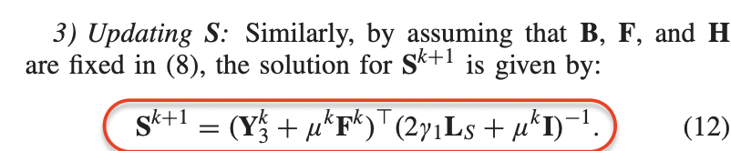
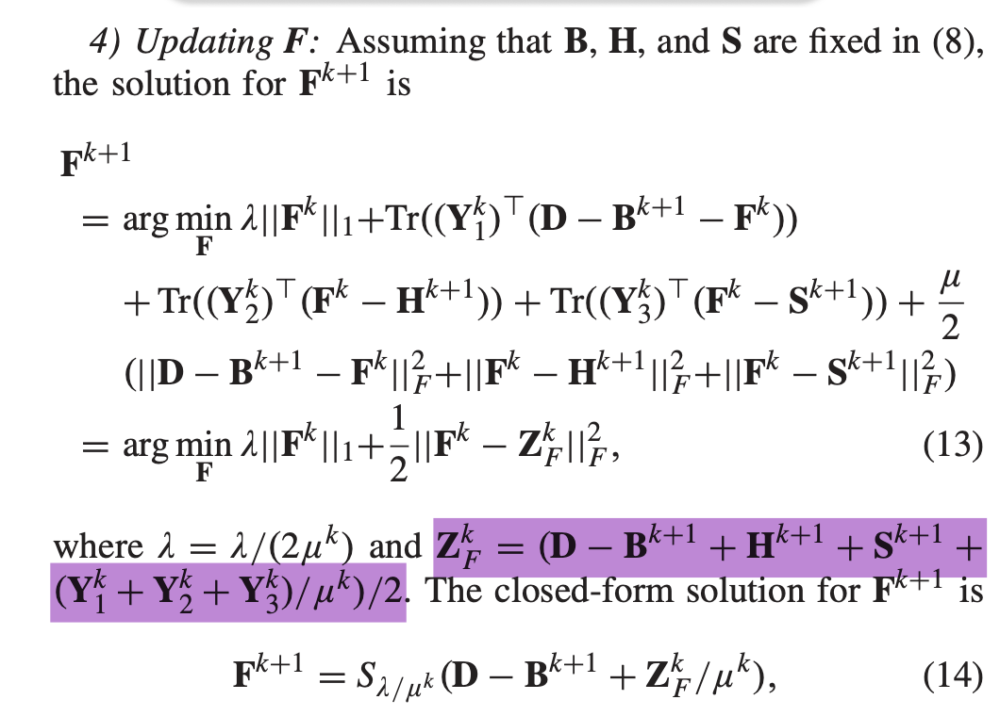
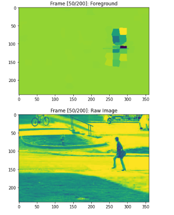
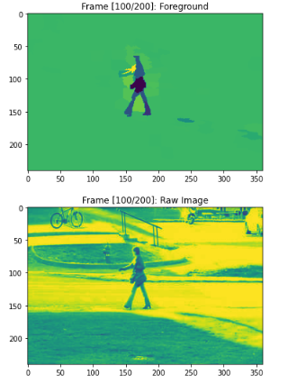
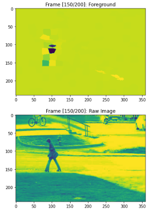
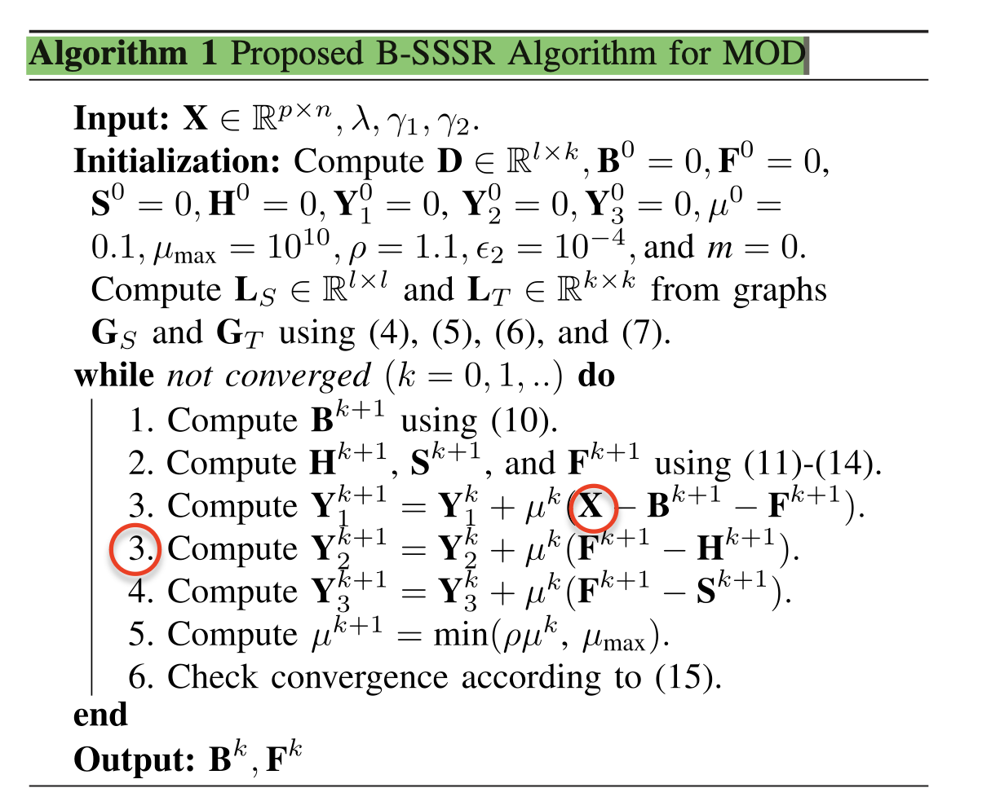

# Implementation Details of SSSR

This repository provides python codes for the `B-SSSR` algorithm of the paper [Moving Object Detection in Complex Scene Using Spatiotemporal Structured-Sparse RPCA](https://ieeexplore.ieee.org/document/8485415) by Sajid Javed; Arif Mahmood; Somaya Al-Maadeed; Thierry Bouwmans; Soon Ki Jung.

## Suspected Typos or My Misunderstandings
 ---
1. $S^{k+1}$ should be of the shape of $(l, k)$. However, $S^{k+1}$ in equation (12) is actually of the shape $(k, l)$. Thus, it needs to **transpose**.

---

2. I honestly implemented equation (14) in my Python codes. However, I found that the algorithm would always **diverge** because of this step.

I found that if I changed equation (14) into $F^{k+1} = S_{\lambda / \mu^k}(D-B^{k+1})$, then the algorithm will converge.

---

3. **How to recover foreground from the raw image is not clear in this article.**
According to Algorithm 1, we will recover the foreground $F$ and background $B$ from the **feature matrix** $D \in \mathbb{R}^{l \times k}$. How to recover the foreground and background from the raw image is not specified in this article. For example,
- Is the pixels from the same superpixel is assigned the same value?
- What is the threshold value used for each different dataset?

---

4. The **middle frame** of a window is used to compute the superpixels and the superpixels are fixed in the window. Thus, the middle frame's foreground extraction is the best in this window. If the other frames' superpixels are very different from the middle frame, then the results are bad. 

    > The number of superpixels is $s=250$ as your article suggested. The dataset used is CDnet/baseline/pedestrians. The window contains $k=200$ images as your article suggested.

- Frame [50/200]: foreground V.S. raw image

- Frame [100/200]: foreground V.S. raw image

- Frame [150/200]: foreground V.S. raw image

---

5. Typos?
- **Matrix dimension mismatch**. X is of the shape $(p, n)$. However, $B^{k+1}$ and $F^{k+1}$ are of the shape $(l, k)$. They do not match. How to compute $X - B^{k+1} - F^{k+1}$? I believe it should be changed into $D - B^{k+1} - F^{k+1}$.
- **There are two step 3 in Algorithm 1.**
  

